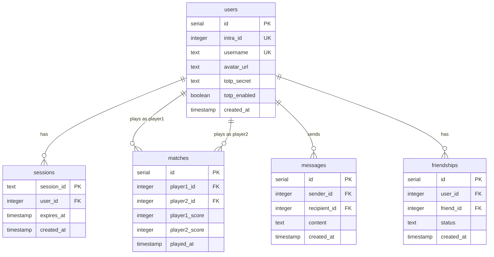

_This project has been created as part of the 42 curriculum by [LOGIN_1], [LOGIN_2], [LOGIN_3], [LOGIN_4], [LOGIN_5]._

# ft_transcendence

## Description

**ft_transcendence** is a real-time multiplayer Pong platform featuring competitive gameplay, live chat, and secure authentication. Players can challenge each other to matches, compete against an AI opponent, track their statistics, and climb the leaderboard.

### Key Features

- **Real-Time Multiplayer Pong** - Server-authoritative game state at 60 ticks/s prevents cheating
- **AI Opponent** - Server-side bot with human-like reaction delays for single-player practice
- **Live Chat** - Direct messages and game invites via WebSocket
- **Secure Authentication** - 42 OAuth integration with optional TOTP-based 2FA
- **User Profiles** - Customizable avatars, friend system, and match history
- **Leaderboard** - Win/loss tracking and player rankings

---

## Instructions

### Prerequisites

- **Docker** & **Docker Compose** (latest versions)
- **Ports available:** 443 (HTTPS), 3000 (frontend), 4000 (backend), 5432 (PostgreSQL)
- **42 API credentials** - obtain from [42 Intra OAuth Applications](https://profile.intra.42.fr/oauth/applications)

### Installation & Execution

1. **Clone the repository:**

   ```bash
   git clone https://github.com/your-org/ft_transcendence.git
   cd ft_transcendence
   ```

2. **Configure environment:**

   ```bash
   cp .env.example .env
   ```

   Edit `.env` with your credentials:

   ```env
   POSTGRES_USER=postgres
   POSTGRES_PASSWORD=<secure-password>
   POSTGRES_DB=ft_transcendence
   FORTYTWO_CLIENT_ID=<your-42-client-id>
   FORTYTWO_CLIENT_SECRET=<your-42-client-secret>
   FORTYTWO_CALLBACK_URL=https://localhost/api/auth/42/callback
   SESSION_SECRET=<random-32-character-string>
   ```

3. **Run the project:**

   ```bash
   docker compose up --build
   ```

4. **Access the application:**
   Open **https://localhost** (accept the self-signed certificate warning)

### Stopping the Application

```bash
docker compose down      # Stop containers
docker compose down -v   # Stop and reset database
```

---

## Team Information

| Member        | Role                           | Responsibilities                                           |
| ------------- | ------------------------------ | ---------------------------------------------------------- |
| **[LOGIN_1]** | Technical Lead / Architect     | Architecture design, DevOps (Docker/Bun), code review      |
| **[LOGIN_2]** | Product Owner                  | Feature prioritization, UI/UX consistency, frontend design |
| **[LOGIN_3]** | Project Manager / Scrum Master | Sprint planning, deadline tracking, team coordination      |
| **[LOGIN_4]** | Backend Developer              | Authentication, database, user management                  |
| **[LOGIN_5]** | Game Developer                 | Game engine, WebSocket implementation, AI opponent         |

---

## Project Management

### Methodology

We use **Agile/Scrum** with weekly sprints and **Vertical Slice Architecture** to enable parallel development.

### Tools & Communication

| Purpose       | Tool                                          |
| ------------- | --------------------------------------------- |
| Task Tracking | GitHub Projects / Issues                      |
| Code Review   | GitHub Pull Requests (1 approval required)    |
| Communication | Discord (`#backend`, `#frontend`, `#general`) |
| Documentation | Markdown files in repository                  |

### Workflow

- **Branching:** `type/scope/description` (e.g., `feat/game/paddle-physics`)
- **Commits:** Conventional Commits enforced by Lefthook
- **Merge:** Squash and merge only

---

## Technical Stack

| Layer        | Technology               | Justification                                                                |
| ------------ | ------------------------ | ---------------------------------------------------------------------------- |
| **Runtime**  | Bun                      | Native TypeScript (no build step), 10x faster startup than Node.js           |
| **Frontend** | SvelteKit                | Mandatory SSR, compiled output, simple state management via stores           |
| **Backend**  | ElysiaJS                 | Bun-optimized, Eden Treaty provides end-to-end type safety with frontend     |
| **Database** | PostgreSQL               | Relational integrity for Users, Matches, and Chat data                       |
| **ORM**      | Drizzle                  | TypeScript-native, no binary dependencies, works in Bun/Alpine containers    |
| **Auth**     | Arctic + Oslo            | Arctic for 42 OAuth, Oslo for TOTP 2FA. Database sessions for instant revoke |
| **Styling**  | Tailwind + Shadcn-Svelte | Utility-first CSS with accessible component primitives (Bits UI)             |
| **Infra**    | Docker + Nginx           | Containerized deployment with HTTPS termination                              |

### Why This Stack?

- **End-to-End Type Safety:** Eden Treaty auto-generates typed API client from backend routes
- **Database Sessions over JWT:** Immediate session revocation on logout/ban, fully explainable during defense
- **Vertical Slice Architecture:** Features are self-contained modules, reducing merge conflicts

---

## Database Schema



| Table         | Purpose                                           |
| ------------- | ------------------------------------------------- |
| `users`       | Authentication data, profile info, 2FA settings   |
| `sessions`    | Database-backed sessions for immediate revocation |
| `matches`     | Game history with scores                          |
| `messages`    | Chat logs between users                           |
| `friendships` | Friend relationships (pending/accepted status)    |

---

## Features List

### Authentication

| Feature            | Description                              | Owner     |
| ------------------ | ---------------------------------------- | --------- |
| 42 OAuth Login     | Redirect-based OAuth flow via Arctic     | [LOGIN_4] |
| Session Management | Database sessions with HttpOnly cookies  | [LOGIN_4] |
| 2FA Setup          | QR code generation and TOTP verification | [LOGIN_4] |
| Logout             | Immediate session invalidation           | [LOGIN_4] |

### User Profile

| Feature       | Description                          | Owner     |
| ------------- | ------------------------------------ | --------- |
| Profile View  | Display username, avatar, stats      | [LOGIN_2] |
| Profile Edit  | Update username, upload avatar (2MB) | [LOGIN_2] |
| Friend System | Send/accept/decline friend requests  | [LOGIN_3] |
| Match History | View past games with scores          | [LOGIN_3] |

### Gameplay

| Feature            | Description                               | Owner     |
| ------------------ | ----------------------------------------- | --------- |
| Pong Game          | Canvas-based game with ball physics       | [LOGIN_5] |
| Matchmaking Queue  | Auto-match within 30 seconds              | [LOGIN_5] |
| AI Opponent        | Server-controlled bot with reaction delay | [LOGIN_5] |
| Remote Multiplayer | Real-time play between two computers      | [LOGIN_5] |

### Chat

| Feature         | Description                      | Owner     |
| --------------- | -------------------------------- | --------- |
| Direct Messages | Real-time private messaging      | [LOGIN_2] |
| Block Users     | Hide messages from blocked users | [LOGIN_2] |
| Game Invites    | Invite friends to play from chat | [LOGIN_2] |

---

## Modules

| Category     | Module                       | Type  | Pts    | Implementation                                     | Owner     |
| ------------ | ---------------------------- | ----- | ------ | -------------------------------------------------- | --------- |
| **Web**      | Use a Framework (Front+Back) | Major | 2      | SvelteKit (frontend) + ElysiaJS (backend)          | [LOGIN_1] |
| **Web**      | Server-Side Rendering        | Minor | 1      | SvelteKit SSR for landing, profiles, match history | [LOGIN_2] |
| **Web**      | Use an ORM                   | Minor | 1      | Drizzle ORM for all database interactions          | [LOGIN_4] |
| **Gaming**   | Web-based Game               | Major | 2      | Pong on HTML5 Canvas with physics engine           | [LOGIN_5] |
| **Gaming**   | Remote Players               | Major | 2      | WebSocket synchronization at 60 ticks/s            | [LOGIN_5] |
| **AI**       | AI Opponent                  | Major | 2      | Server-side bot with 100ms reaction delay          | [LOGIN_5] |
| **User**     | Standard User Management     | Major | 2      | 42 OAuth, profile editing, avatar upload, friends  | [LOGIN_4] |
| **User**     | Game Statistics              | Minor | 1      | Win/loss ratio, match history, leaderboard         | [LOGIN_3] |
| **Security** | 2FA                          | Minor | 1      | TOTP via Oslo (Google Authenticator compatible)    | [LOGIN_4] |
|              |                              |       | **14** |                                                    |           |

### Module Justifications

- **Frameworks (2pts):** SvelteKit provides mandatory SSR; ElysiaJS offers Eden Treaty for end-to-end type safety
- **ORM (1pt):** Drizzle chosen over Prisma for Bun/Alpine compatibility (no binary dependencies)
- **AI Opponent (2pts):** Human-like behavior with 100ms reaction delay and ±20px error margin prevents perfect play
- **2FA (1pt):** Oslo TOTP allows full code transparency for defense (no "black box" libraries)

---

## Individual Contributions

### [LOGIN_1] - Technical Lead / Architect

- Set up Bun monorepo with workspaces configuration
- Configured Docker infrastructure (Nginx, PostgreSQL, multi-stage builds)
- Established Biome/Lefthook tooling for code quality
- Designed vertical slice architecture and reviewed all PRs
- **Challenges:** Resolving Bun/Alpine compatibility issues with native modules

### [LOGIN_2] - Product Owner / Frontend Lead

- Built SvelteKit application structure and routing
- Implemented Shadcn-Svelte design system with Tailwind
- Created responsive layouts for all pages
- Developed chat UI and WebSocket integration
- **Challenges:** Handling SvelteKit SSR hydration with real-time state

### [LOGIN_3] - Project Manager / Developer

- Managed sprint planning and GitHub Projects board
- Implemented friend system and user statistics
- Built match history page with pagination
- Created leaderboard component
- **Challenges:** Coordinating feature dependencies across team members

### [LOGIN_4] - Backend Developer / Auth Specialist

- Implemented 42 OAuth flow using Arctic library
- Built database session system following Lucia patterns
- Added TOTP 2FA using Oslo library
- Created user profile CRUD operations
- **Challenges:** Understanding OAuth state management and PKCE flow

### [LOGIN_5] - Game Developer

- Built PongEngine with server-authoritative physics
- Implemented WebSocket gateway for real-time game state
- Created AI opponent with configurable difficulty
- Handled client prediction and server reconciliation
- **Challenges:** Achieving smooth 60fps gameplay with network latency compensation

---

## Resources

### Documentation

- [ElysiaJS](https://elysiajs.com) - Backend framework
- [SvelteKit](https://kit.svelte.dev) - Frontend framework
- [Drizzle ORM](https://orm.drizzle.team) - Database ORM
- [Bun](https://bun.sh) - JavaScript runtime
- [Arctic](https://arcticjs.dev) - OAuth library
- [Oslo](https://oslo.js.org) - TOTP library

### AI Usage Disclosure

AI tools (GitHub Copilot, Claude) were used to assist with:

- **Boilerplate generation:** Initial Drizzle schema definitions and TypeBox validation types
- **Debugging:** Analyzing Docker networking errors and WebSocket connection issues
- **Documentation:** Drafting initial README structure and ADR templates
- **Code review:** Identifying potential security vulnerabilities and type errors

_All AI-generated code was manually reviewed, tested, and understood by team members. During evaluation, any team member can explain any part of the codebase._

---

## Legal

- [Privacy Policy](/privacy) - How we handle user data
- [Terms of Service](/terms) - Usage terms and conditions

---

## License

This project is licensed under the MIT License - see the [LICENSE](LICENSE) file for details.
