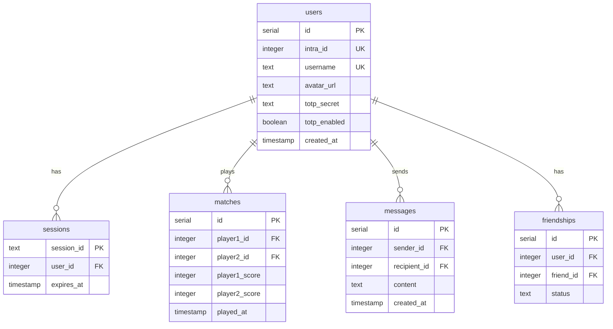

# Architecture

Technical patterns and protocols for ft_transcendence.

> **Rationale:** See [ADRs](./decisions/0001-use-bun-elysia-sveltekit-stack) for
> decision records.

---

## 1. Tech Stack

| Component    | Choice                   | Why                                           |
| ------------ | ------------------------ | --------------------------------------------- |
| **Runtime**  | Bun                      | Built-in TypeScript, unified toolchain        |
| **Monorepo** | Bun Workspaces           | Dependency linking without TurboRepo overhead |
| **Frontend** | SvelteKit                | SSR (1pt), smaller bundles, simple stores     |
| **Backend**  | ElysiaJS                 | Bun-optimized, Eden Treaty type safety        |
| **Database** | PostgreSQL + Drizzle     | Relational integrity, TypeScript-native ORM   |
| **Auth**     | Arctic + Oslo            | 42 OAuth + TOTP, database sessions            |
| **Styling**  | Tailwind + Shadcn-Svelte | Utility CSS, accessible primitives            |
| **Tooling**  | Biome + Lefthook         | Fast formatting, parallel pre-commit          |
| **Infra**    | Docker + Nginx           | HTTPS termination, single-command deploy      |

---

## 2. Directory Structure

```text
ft_transcendence/
├── .devcontainer/           # Dev Container config
├── .github/                 # CI workflows
├── apps/
│   ├── api/
│   │   └── src/
│   │       ├── common/      # Shared guards, decorators, types
│   │       ├── db/          # Drizzle config, schema, migrations
│   │       ├── modules/     # <-- VERTICAL SLICES
│   │       │   ├── auth/    # OAuth, 2FA, sessions
│   │       │   ├── chat/    # WebSocket chat
│   │       │   ├── game/    # Game engine (see Hybrid Architecture)
│   │       │   └── users/   # Profile, friends, stats
│   │       └── index.ts     # App entry point
│   │
│   └── web/
│       └── src/
│           ├── lib/
│           │   ├── api.ts       # Eden Treaty client
│           │   ├── stores/      # Svelte stores (game state, user, etc.)
│           │   └── components/  # Shadcn-Svelte UI components
│           └── routes/          # SvelteKit pages
│
├── packages/                # Shared types/configs (if needed)
├── biome.json
├── lefthook.yml
├── compose.yaml
└── package.json             # Workspaces definition
```

---

## 3. Backend Architecture

### Vertical Slice Pattern

Each feature module contains all its layers:

```
modules/auth/
├── auth.controller.ts    # HTTP + validation (TypeBox). NO DB calls.
├── auth.service.ts       # Business logic (framework-agnostic)
├── auth.repository.ts    # Drizzle queries (ONLY DB access point)
└── auth.dto.ts           # Types
```

### Game Module (Hexagonal)

```
modules/game/
├── domain/              # Pure TS - no framework imports, unit testable
│   ├── PongEngine.ts    # Physics, game loop, scoring
│   ├── Ball.ts
│   ├── Paddle.ts
│   └── AIPlayer.ts      # Bot with reaction delay
├── game.controller.ts   # HTTP: queue, matchmaking
├── game.service.ts      # Orchestration
├── game.gateway.ts      # WebSocket handler
└── game.repository.ts   # Match history persistence
```

---

## 4. Authentication

Database sessions (not JWT) for immediate revocation.

### OAuth Flow

1. Redirect to 42 Intra (Arctic generates URL)
2. Callback → exchange code for token → fetch profile
3. Upsert user, create session, set HttpOnly cookie
4. Each request validates session from DB

### 2FA Flow (Oslo TOTP)

1. Enable → generate secret, show QR code
2. User scans with authenticator app
3. Login prompts for 6-digit code if 2FA enabled

---

## 5. WebSocket Protocols

### Game (`wss://localhost/api/game/ws?gameId={id}`)

```typescript
// Client → Server
{ type: "input", direction: "up" | "down" | "none" }
{ type: "ready" }

// Server → Client (60 ticks/s)
{ type: "state", ball: {x, y}, paddles: [{y}, {y}], score: [p1, p2] }
{ type: "countdown", seconds: 3 }
{ type: "gameOver", winner: "player1" | "player2" }
```

### Chat (`wss://localhost/api/chat/ws`)

```typescript
// Client → Server
{ type: "message", to: recipientId, content: string }

// Server → Client
{ type: "message", from: senderId, content: string, timestamp: string }
{ type: "userOnline", userId: number }
```

---

## 6. Frontend Integration

### Eden Treaty Client

```typescript
// apps/web/src/lib/api.ts
import { treaty } from "@elysiajs/eden";
import type { App } from "../../../api/src/index";

export const api = treaty<App>("https://localhost/api");

// Full autocomplete from backend types
const { data, error } = await api.users.me.get();
```

### State Management

| Type         | Solution                              |
| ------------ | ------------------------------------- |
| Server data  | SvelteKit `load` functions            |
| Client state | Svelte stores (`writable`, `derived`) |
| Real-time    | WebSocket → write to stores           |
| Forms        | Superforms + Zod                      |

---

## 7. Database Schema



---

## 8. Error Handling

### Backend (Elysia)

```typescript
import { error } from "elysia";

// In controllers - throws HTTP errors
if (!user) throw error(404, "User not found");
if (!authorized) throw error(403, "Forbidden");
// TypeBox validation → 400 automatically
```

### Frontend (Eden Treaty)

```typescript
const { data, error } = await api.users.me.get();
if (error) {
  toast.error(error.value.message); // error.status available
}
```

### WebSocket

- Connection drop → exponential backoff reconnect
- Game desync → request full state from server

---

## 9. Commands

| Task          | Command                                 |
| ------------- | --------------------------------------- |
| Start stack   | `docker compose up --build`             |
| Install deps  | `bun install`                           |
| Migrations    | `cd apps/api && bun run migrate`        |
| Format        | `bun run biome check --apply .`         |
| Type check    | `bun run tsc --noEmit` (api)            |
| Type check    | `cd apps/web && bun run check`          |
| Add component | `cd apps/web && bunx shadcn-svelte add` |
